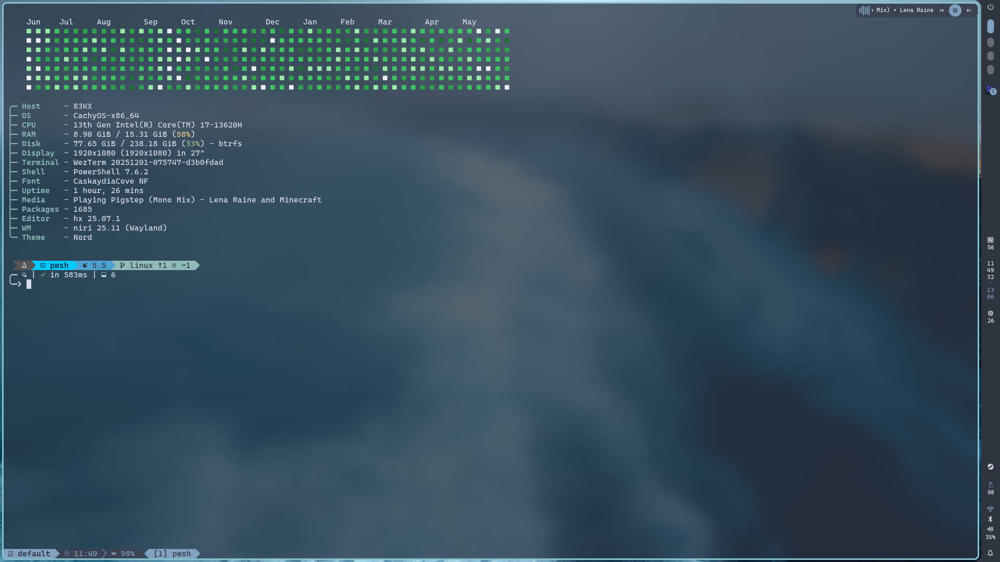
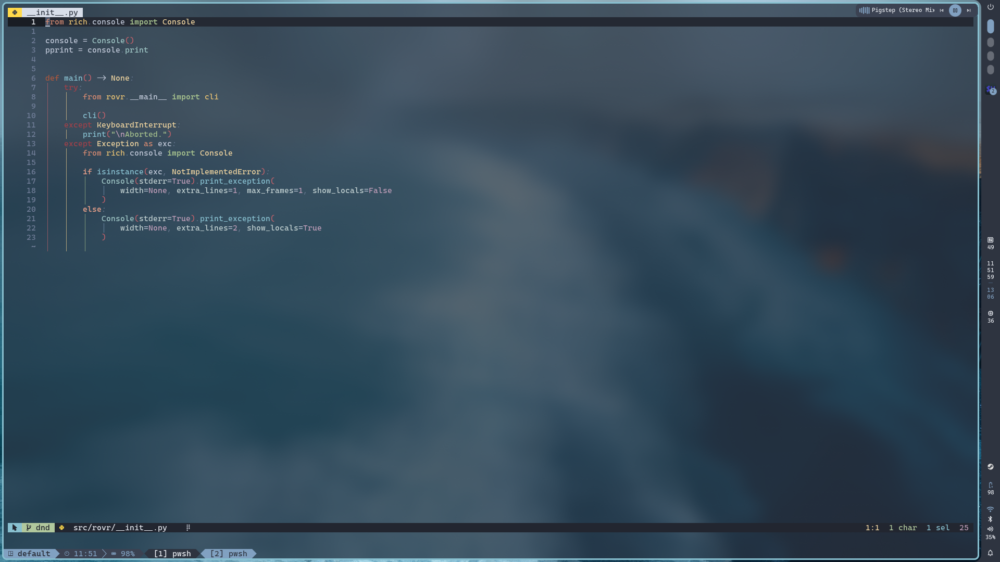
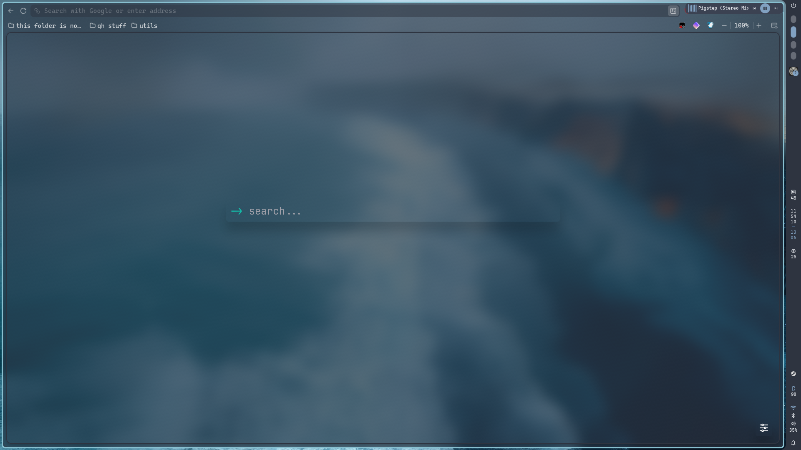
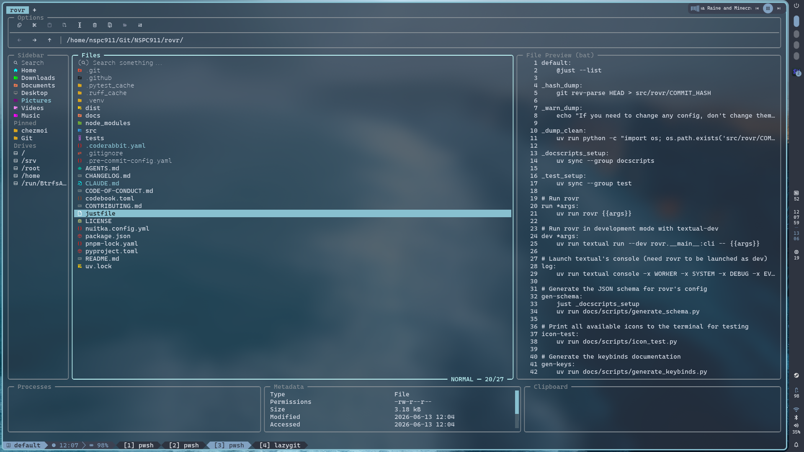

# dotfiles

The alternate side, the linux version. Still Nord + Transparency.

## Screenshots

|  <br> gitfetch + fastfetch |       <br> helix       |
| :-----------------------------------------------: | :-----------------------------------------------: |
|    <br> zen browser    |  <br> rovr, my file explorer |

## Apps

#### Categories

| Type                  | App                                                                                                                 | Location in repository                                                   |
| --------------------- | ------------------------------------------------------------------------------------------------------------------- | ------------------------------------------------------------------------ |
| Window Manager        | [niri](https://github.com/niri-wm/niri)                                                                             | `dot_config/niri/config.kdl`                                             |
| GUI Shell             | [DankMaterialShell](https://github.com/AvengeMedia/DankMaterialShell)                                               | `dot_config/DankMaterialShell/settings.json`                             |
| Terminal **emulator** | [wezterm](https://github.com/wezterm/wezterm)                                                                       | `dot_wezterm.lua`                                                        |
| Terminal              | [PowerShell 7.5](https://github.com/PowerShell/PowerShell)                                                          | `dot_config/powershell/Microsoft.PowerShell_profile.ps1`                 |
| Fetch                 | [fastfetch](https://github.com/fastfetch-cli/fastfetch) + [gitfetch](https://github.com/Matars/gitfetch)            | fastfetch: `dot_config/fastfetch/config.jsonc`                           |
| Prompt                | [oh-my-posh](https://github.com/jandedobbeleer/oh-my-posh)                                                          | `dot_config/kushal.omp.json`                                             |
| Editor                | [helix](https://github.com/helix-editor/helix) [(custom built)](https://github.com/NSPC911-forks/helix/tree/patchy) | `dot_config/helix/`                                                      |
| File Explorer (TUI)   | [rovr](https://github.com/NSPC911/rovr)                                                                             | `dot_config/rovr/`                                                       |
| Browser               | [Zen](https://github.com/zen-browser/desktop)                                                                       | `zen/`                                                                   |
| Discord Mod           | [Vencord](https://github.com/Vendicated/Vencord)                                                                    | [NSPC911/themes:vencord](https://github.com/NSPC911/themes/tree/vencord) |
| Git UI                | [lazygit](https://github.com/jesseduffield/lazygit)                                                                 | `dot_config/lazygit/config.yml`                                          |
| File Output           | [bat](https://github.com/sharkdp/bat)                                                                               | `dot_config/bat/config`                                                  |
| Pager                 | [ov](https://github.com/noborus/ov)                                                                                 | `dot_config/ov/config.yaml`                                              |

#### Wallpaper

Generally I switch between 3 options (screenshots from steam!)

|    <br> [link](https://steamcommunity.com/sharedfiles/filedetails/?id=3352465485)   |  <br> [link](https://steamcommunity.com/sharedfiles/filedetails/?id=3360569178) |
| :--------------------------------------------------------------------------------------------------------------------------------------------------------------------------------------------------------------------------------------------------------------------------------: | :-----------------------------------------------------------------------------------------------------------------------------------------------------------------------------------------------------------------------------------------------------------------------------: |
| ![Sunset Cat [4k]](https://images.steamusercontent.com/ugc/43443618358467438/204AE1F0F54142B3670712E3546E6E2EE76D07BE/?imw=637&imh=358&ima=fit&impolicy=Letterbox&imcolor=%23000000&letterbox=true) <br> [link](https://steamcommunity.com/sharedfiles/filedetails/?id=3373818743) |                                                                                                                                                                                                                                                                                 |

#### No config

| Type            | Link                                                                                               |
| --------------- | -------------------------------------------------------------------------------------------------- |
| Nerd Font       | [CaskaydiaCove NF](https://github.com/ryanoasis/nerd-fonts/tree/master/patched-fonts/CascadiaCode) |
| Package Manager | [yay](https://github.com/jguer/yay)                                                                |
| Pixel Art       | [Pixelorama](https://github.com/Orama-Interactive/Pixelorama)                                      |
| Roblox          | [Sober](https://sober.vinegarhq.org/)                                                              |
| Cursor          | [Bibata](https://github.com/ful1e5/Bibata_Cursor)                                                  |

#### cargo installations

```
tokei
> cargo install --git https://github.com/XAMPPRocky/tokei.git tokei
helix
> cargo xtask steel
```

#### uv tools

<!--uv tool list --show-with --show-extras --show-version-specifiers, remove `- `-->

```
ansible-lint v26.4.0
batrachian-toad v0.6.20
gitfetch v1.3.2 [required:  git+https://github.com/matars/gitfetch@4a113b5e05d200c83422d30e21391b47886186e0]
hike v1.4.0
mistral-vibe v2.14.1
poethepoet v0.46.0
poetry v2.4.1
ptf v0.1.0 [required:  git+https://github.com/nspc911/ptf]
pyright v1.1.410
rich-cli v1.8.1
rovr v0.9.1.post1 [required:  git+https://github.com/nspc911/rovr]
ruff v0.15.17
ty v0.0.40 [required: ==0.0.40]
```

#### pnpm global installs

<!--pnpm list -g, remove header-->

```
@agentclientprotocol/claude-agent-acp@0.38.0
@ansible/ansible-language-server@26.6.0
@anthropic-ai/claude-code@2.1.173
@astrojs/language-server@2.16.10
@fsouza/prettierd@0.27.0
@github/copilot@1.0.61
@google/gemini-cli@0.42.0
live-server@1.2.2
oxfmt@0.51.0
typescript@6.0.3
typescript-language-server@5.3.0
vscode-langservers-extracted@4.10.0
```

#### Browser extensions (zen)

| Name                                                               | Location                             |
| ------------------------------------------------------------------ | ------------------------------------ |
| [Refined GitHub](https://github.com/refined-github/refined-github) | `zen/extensions/refined_github.json` |
| [tabliss](https://tabliss.io/)                                     | `zen/extensions/tabliss.json`        |
| [vimium](https://github.com/philc/vimium)                          | `zen/extensions/vimium-options.json` |

#### powershell modules

| Name                                 | Description                            | Installer                                             |
| ------------------------------------ | -------------------------------------- | ----------------------------------------------------- |
| PSReadLine                           | read keybinds + autocomplete           | `Install-Module PSReadline`                           |
| PoshGit                              | git autocompletions                    | `Install-Module posh-git`                             |
| PS-Fzf                               | fzf in powershell                      | `Install-Module PSFzf`                                |
| Microsoft.PowerShell.ConsoleGuiTools | gui tools in the shell                 | `Install-Module Microsoft.PowerShell.ConsoleGuiTools` |
| Terminal-Icons                       | nerdfont icons in Get-ChildItem + more | `Install-Module Terminal-Icons`                       |
| PwshSpectreConsole                   | advanced console features              | `Install-Module PwshSpectreConsole`                   |
| PSToml                               | toml parsing                           | `Install-Module PSToml`                               |
| scoop-completions                    | scoop completions                      | `scoop install scoop-completion`                      |
| PSEverything                         | everything integration into powershell | `Install-Module PSEverything`                         |

#### Previously used, but no longer using

| Type                | App                                                                   | Location                                                           |
| ------------------- | --------------------------------------------------------------------- | ------------------------------------------------------------------ |
| Terminal emulator   | [rio](https://github.com/raphamorim/rio)                              | `AppData/Local/rio/`                                               |
| Terminal emulator   | [alacritty](https://github.com/alacritty/alacritty)                   | `AppData/Roaming/alacritty/`                                       |
| Tiling Manager      | [komorebi](https://github.com/LGUG2Z/komorebi)                        | `komorebi.json`                                                    |
| File Explorer (TUI) | [superfile](https://github.com/yorukot/superfile)                     | `AppData/Local/superfile/`                                         |
| File Explorer (GUI) | [OneCommanger](https://www.onecommander.com)                          | `readonly_scoop/persist/onecommander/Settings/OneCommanderV3.json` |
| Hotkey Daemon       | [whkd](https://github.com/LGUG2Z/whkd)                                | `dot_config/whkdrc`                                                |
| Transparency        | [MicaForEveryone](https://github.com/MicaForEveryone/MicaForEveryone) | `AppData/Local/Mica For Everyone/MicaForEveryone.conf`             |

### Stats

<!--tokei --sort lines-->

```
━━━━━━━━━━━━━━━━━━━━━━━━━━━━━━━━━━━━━━━━━━━━━━━━━━━━━━━━━━━━━━━━━━━━━━━━━━━━━━━━━
 Language              Files        Lines         Code     Comments       Blanks
━━━━━━━━━━━━━━━━━━━━━━━━━━━━━━━━━━━━━━━━━━━━━━━━━━━━━━━━━━━━━━━━━━━━━━━━━━━━━━━━━
 JSON                     20         4140         4140            0            0
 CSS                      11         3304         2668          247          389
 TOML                     11         1692         1401          167          124
 PowerShell                6         1249         1063           73          113
 Scheme                    6          961          840           27           94
 YAML                      2          329          308           17            4
 Lua                       1          243          219           12           12
 Markdown                 10          227            0          172           55
 BASH                      1           84           60           13           11
━━━━━━━━━━━━━━━━━━━━━━━━━━━━━━━━━━━━━━━━━━━━━━━━━━━━━━━━━━━━━━━━━━━━━━━━━━━━━━━━━
 Total                    68        12229        10699          728          802
━━━━━━━━━━━━━━━━━━━━━━━━━━━━━━━━━━━━━━━━━━━━━━━━━━━━━━━━━━━━━━━━━━━━━━━━━━━━━━━━━
```

<p align="center">
  <picture>
    <source srcset="https://raw.githubusercontent.com/nordtheme/assets/main/static/images/elements/separators/iceberg/footer/dark/spaced.svg?sanitize=true" width="100%" media="(prefers-color-scheme: light), (prefers-color-scheme: no-preference)" />
    <source srcset="https://raw.githubusercontent.com/nordtheme/assets/main/static/images/elements/separators/iceberg/footer/light/spaced.svg?sanitize=true" width="100%" media="(prefers-color-scheme: dark)" />
    
  </picture>
</p>
