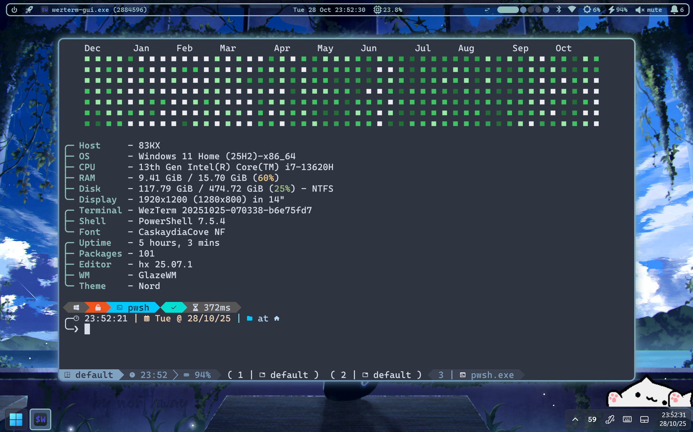
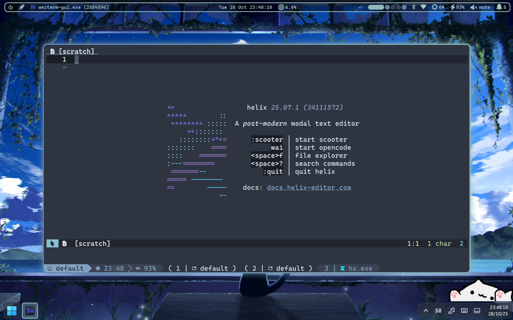
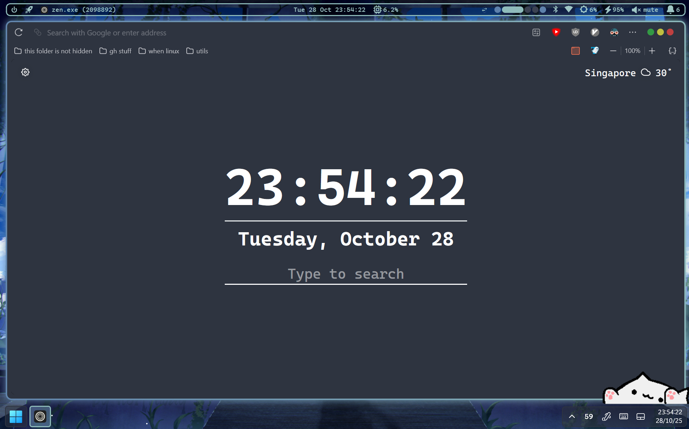

# dotfiles

My Windows 11 config files, Nord + Translucency

## Screenshots

|  <br> gitfetch + fastfetch |                   <br> helix                   |
| :-----------------------------------------------: | :-----------------------------------------------------------------------: |
|    <br> zen browser    |  <br> rovr, my file explorer                         |
|                                                   |                                                      |

## Apps

#### Categories

| Type                  | App                                                                                                                 | Location in repository                                                    |
| --------------------- | ------------------------------------------------------------------------------------------------------------------- | ------------------------------------------------------------------------- |
| Tiling Manager        | [GlazeWM](https://github.com/glzr-io/glazewm)                                                                       | `dot_glzr/glazewm/config.yaml`                                            |
| Window Borders        | [Tacky Borders](https://github.com/lukeyou05/tacky-borders)                                                         | `dot_config/tacky-borders/config.yaml`                                    |
| Tiling Helper         | [AltSnap](https://github.com/RamonUnch/AltSnap)                                                                     | `readonly_scoop/persist/altsnap/AltSnap.ini`                              |
| Status Bar            | [yasb](https://github.com/amnweb/yasb)                                                                              | `dot_config/yasb/`                                                        |
| Terminal **emulator** | [wezterm](https://github.com/wezterm/wezterm)                                                                       | `.wezterm.lua`                                                            |
| Terminal              | [PowerShell 7.5](https://github.com/PowerShell/PowerShell)                                                          | `OneDrive/readonly_Documents/PowerShell/Microsoft.PowerShell_profile.ps1` |
| Fetch                 | [fastfetch](https://github.com/fastfetch-cli/fastfetch) + [gitfetch](https://github.com/Matars/gitfetch)            | fastfetch: `dot_config/fastfetch/config.jsonc`                            |
| Prompt                | [oh-my-posh](https://github.com/jandedobbeleer/oh-my-posh)                                                          | `dot_config/kushal.omp.json`                                              |
| Mod Manager           | [Windhawk](https://github.com/ramensoftware/windhawk)                                                               | `windhawk/`                                                               |
| Editor                | [helix](https://github.com/helix-editor/helix) [(custom built)](https://github.com/NSPC911-forks/helix/tree/patchy) | `AppData/Roaming/helix/`                                                  |
| File Explorer (TUI)   | [rovr](https://github.com/NSPC911/rovr)                                                                             | `AppData/Local/rovr/`                                                     |
| Browser               | [Zen](https://github.com/zen-browser/desktop)                                                                       | `zen/userChrome.css`                                                      |
| Discord Mod           | [Vencord](https://github.com/Vendicated/Vencord)                                                                    | [NSPC911/themes:vencord](https://github.com/NSPC911/themes/tree/vencord)  |
| Git UI                | [lazygit](https://github.com/jesseduffield/lazygit)                                                                 | `AppData/Local/lazygit/config.yml`                                        |
| File Output           | [bat](https://github.com/sharkdp/bat)                                                                               | `readonly_scoop/persist/bat/`                                             |
| Launcher              | [Flow Launcher](https://github.com/Flow-Launcher/Flow.Launcher)                                                     | `readonly_scoop/persist/flow-launcher/UserData/Settings/`                 |
| Pager                 | [ov](https://github.com/noborus/ov)                                                                                 | `dot_config/ov/config.yaml`                                               |

#### Wallpaper

[Just Mazes](https://steamcommunity.com/sharedfiles/filedetails/?id=1550989740) with the [Nord Theme maze generator](https://steamcommunity.com/sharedfiles/filedetails/?id=3172644398) preset.


#### No config

| Type            | Link                                                                                               |
| --------------- | -------------------------------------------------------------------------------------------------- |
| Nerd Font       | [CaskaydiaCove NF](https://github.com/ryanoasis/nerd-fonts/tree/master/patched-fonts/CascadiaCode) |
| Package Manager | [scoop](https://github.com/ScoopInstaller/scoop)                                                   |
| Utilities       | [PowerToys](https://github.com/Microsoft/PowerToys)                                                |
| Fun             | [bongocat](https://github.com/NSPC911/bongo-cat)                                                   |
| Pixel Art       | [Pixelorama](https://github.com/Orama-Interactive/Pixelorama)                                      |
| File Indexer    | [everything](https://voidtools.com)                                                                |
| Music           | [youtube-music](https://github.com/th-ch/youtube-music)                                            |
| Roblox Mod      | [BloxStrap](https://github.com/bloxstraplabs/bloxstrap)                                            |
| Cursor          | https://www.deviantart.com/jepricreations/art/Windows-11-Cursors-Concept-886489356                 |

#### cargo installations

```
tokei
> cargo install --git https://github.com/XAMPPRocky/tokei.git tokei
helix
> cargo xtask steel
```

#### uv tools

<!--uv tool list --show-with --show-extras --show-version-specifiers, remove `- `-->
```
gitfetch v1.3.2 [required:  git+https://github.com/matars/gitfetch@4a113b5e05d200c83422d30e21391b47886186e0]
hike v1.2.1
mistral-vibe v2.2.1
poethepoet v0.42.0
poetry v2.3.2
ptf v0.1.0 [required:  git+https://github.com/nspc911/ptf]
pyright v1.1.408
rich-cli v1.8.1
rovr v0.8.0.dev1 [required: file:///C:/Users/notso/Git/NSPC911/rovr/dist/rovr-0.8.0.dev1-py3-none-any.whl]
ruff v0.15.2
ty v0.0.8 [required: ==0.0.8]
```

#### pnpm global installs

<!--pnpm list -g, remove unnecessary parts-->
```
│   dependencies:
├── @ansible/ansible-language-server@1.2.3
├── @astrojs/language-server@2.16.3
├── @fsouza/prettierd@0.26.2
├── @github/copilot@0.0.383
├── @google/gemini-cli@0.13.0
├── corepack@0.34.6
├── live-server@1.2.2
├── prettier@3.8.1
├── typescript@5.9.3
├── typescript-language-server@5.1.3
├── vscode-langservers-extracted@4.10.0
└── wezterm-mcp@1.0.0
```

#### Browser extensions (zen)

| Name                                                               | Location                             |
| ------------------------------------------------------------------ | ------------------------------------ |
| [Refined GitHub](https://github.com/refined-github/refined-github) | `zen/extensions/refined_github.json` |
| [tabliss](https://tabliss.io/)                                     | `zen/extensions/tabliss.json`        |
| [vimium](https://github.com/philc/vimium)                          | `zen/extensions/vimium-options.json` |
| [mtab](https://github.com/maxhu08/mtab)                            | `zen/extensions/mtab.json`           |

#### powershell modules

| Name                                 | Description                            | Installer                                             |
| ------------------------------------ | -------------------------------------- | ----------------------------------------------------- |
| PSReadLine                           | read keybinds + autocomplete           | `Install-Module PSReadline`                           |
| PoshGit                              | git autocompletions                    | `Install-Module posh-git`                             |
| PS-Fzf                               | fzf in powershell                      | `Install-Module PSFzf`                                |
| Microsoft.PowerShell.ConsoleGuiTools | gui tools in the shell                 | `Install-Module Microsoft.PowerShell.ConsoleGuiTools` |
| Terminal-Icons                       | nerdfont icons in Get-ChildItem + more | `Install-Module Terminal-Icons`                       |
| PwshSpectreConsole                   | advanced console features              | `Install-Module PwshSpectreConsole`                   |
| PSToml                               | toml parsing                           | `Install-Module PSToml`                               |
| scoop-completions                    | scoop completions                      | `scoop install scoop-completion`                      |
| PSEverything                         | everything integration into powershell | `Install-Module PSEverything`                         |

#### Previously used, but no longer using

| Type                | App                                                                   | Location                                                           |
| ------------------- | --------------------------------------------------------------------- | ------------------------------------------------------------------ |
| Terminal emulator   | [rio](https://github.com/raphamorim/rio)                              | `AppData/Local/rio/`                                               |
| Terminal emulator   | [alacritty](https://github.com/alacritty/alacritty)                   | `AppData/Roaming/alacritty/`                                       |
| Tiling Manager      | [komorebi](https://github.com/LGUG2Z/komorebi)                        | `komorebi.json`                                                    |
| File Explorer (TUI) | [superfile](https://github.com/yorukot/superfile)                     | `AppData/Local/superfile/`                                         |
| File Explorer (GUI) | [OneCommanger](https://www.onecommander.com)                          | `readonly_scoop/persist/onecommander/Settings/OneCommanderV3.json` |
| Hotkey Daemon       | [whkd](https://github.com/LGUG2Z/whkd)                                | `dot_config/whkdrc`                                                |
| Transparency        | [MicaForEveryone](https://github.com/MicaForEveryone/MicaForEveryone) | `AppData/Local/Mica For Everyone/MicaForEveryone.conf`             |

### Stats

<!--tokei --sort lines-->
```
━━━━━━━━━━━━━━━━━━━━━━━━━━━━━━━━━━━━━━━━━━━━━━━━━━━━━━━━━━━━━━━━━━━━━━━━━━━━━━━━━
 Language              Files        Lines         Code     Comments       Blanks
━━━━━━━━━━━━━━━━━━━━━━━━━━━━━━━━━━━━━━━━━━━━━━━━━━━━━━━━━━━━━━━━━━━━━━━━━━━━━━━━━
 JSON                     59         4334         4333            0            1
 CSS                      11         3959         3188          282          489
 TOML                     11         1748         1462          164          122
 YAML                      5         1192         1072           53           67
 PowerShell                3         1033          877           58           98
 Scheme                    6          955          840           21           94
 INI                       1          687          170          414          103
 Lua                       1          237          216            9           12
 Markdown                 10          220            0          172           48
━━━━━━━━━━━━━━━━━━━━━━━━━━━━━━━━━━━━━━━━━━━━━━━━━━━━━━━━━━━━━━━━━━━━━━━━━━━━━━━━━
 Total                   107        14365        12158         1173         1034
━━━━━━━━━━━━━━━━━━━━━━━━━━━━━━━━━━━━━━━━━━━━━━━━━━━━━━━━━━━━━━━━━━━━━━━━━━━━━━━━━
```

<p align="center">
  <picture>
    <source srcset="https://raw.githubusercontent.com/nordtheme/assets/main/static/images/elements/separators/iceberg/footer/dark/spaced.svg?sanitize=true" width="100%" media="(prefers-color-scheme: light), (prefers-color-scheme: no-preference)" />
    <source srcset="https://raw.githubusercontent.com/nordtheme/assets/main/static/images/elements/separators/iceberg/footer/light/spaced.svg?sanitize=true" width="100%" media="(prefers-color-scheme: dark)" />
    
  </picture>
</p>
